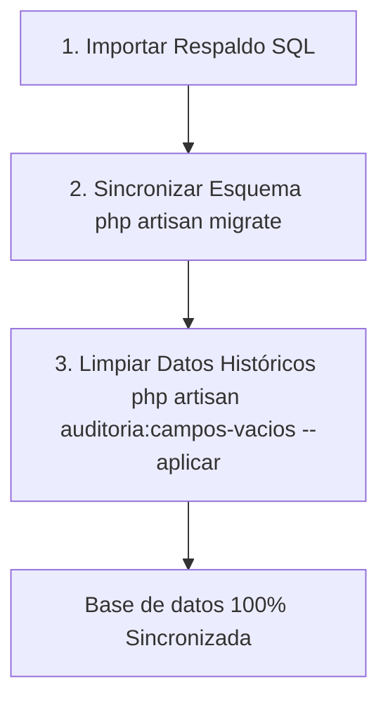

# Guía de Restauración y Sincronización de la Base de Datos

Esta guía detalla los pasos necesarios para importar un respaldo de la base de datos original (producción/legacy) y sincronizarlo para que su estructura y datos coincidan perfectamente con el código de Laravel actual.

---

## Contexto
Durante el proceso de desarrollo y modernización, se han aplicado cambios estructurales (migraciones) y reglas semánticas de datos (campos vacíos convertidos a `NULL`). 

Al descargar un respaldo de producción/legacy, este vendrá desactualizado. Sigue esta guía para ponerlo al día en menos de un minuto de forma automatizada.

---

## Flujo de Trabajo en 3 Pasos



### Paso 1: Importar el Respaldo SQL
Crea la base de datos limpia en tu entorno local (o usa la existente) e importa el archivo `.sql` de producción.

**Desde la terminal:**
```bash
mysql -u tu_usuario -p nombre_base_datos < ruta_del_respaldo.sql
```
*También puedes realizar este paso usando herramientas gráficas como TablePlus, DBeaver, o phpMyAdmin.*

---

### Paso 2: Sincronizar el Esquema (Migraciones)
Ejecuta el comando de migraciones de Laravel. Esto aplicará todas las actualizaciones estructurales que se han realizado en el proyecto sin romper los datos existentes:
```bash
php artisan migrate
```

> [!IMPORTANT]
> **¿Qué hace este paso por debajo?**
> * Elimina de forma segura la columna obsoleta `id_impresora` de la tabla `movimientos_insumos_impresoras`.
> * Altera la tabla `mobiliario` para hacer que las columnas `serie` y `otros` sean `nullable` físicamente en MySQL (originalmente eran `NOT NULL` con defaults vacíos).
> * Registra el historial de cambios en la tabla de control `migrations`.

---

### Paso 3: Limpiar Datos Vacíos (Conversión a `NULL`)
Ejecuta el comando Artisan personalizado que escanea la base de datos en busca de campos nullable que tengan cadenas vacías (`''`) en lugar de `NULL`, y realiza la conversión en una transacción de base de datos segura:
```bash
php artisan auditoria:campos-vacios --aplicar
```
*El comando te mostrará un desglose detallado de qué tablas y columnas contienen datos obsoletos y te pedirá confirmación (`yes/no`) antes de proceder.*

---

## Verificación
Una vez concluidos los tres pasos, puedes verificar que todo esté en orden ejecutando el comando de auditoría en modo de solo reporte:
```bash
php artisan auditoria:campos-vacios
```

**Resultado esperado:**
```text
Escaneando 'nombre_bd' — 117 columnas de texto nullable...
No se encontraron columnas con cadenas vacías. Nada que limpiar.
```

---

## Resumen de Buenas Prácticas para el Equipo
> [!TIP]
> * **Columnas Opcionales:** Al agregar nuevas columnas opcionales en futuras migraciones, asegúrate siempre de usar el modificador `->nullable()`.
> * **Controladores:** Evita usar el patrón `trim($request->campo ?? '')` en campos opcionales. En su lugar, usa el validador con `nullable` y el patrón estándar:
>   `'campo' => $request->filled('campo') ? trim($request->campo) : null`
