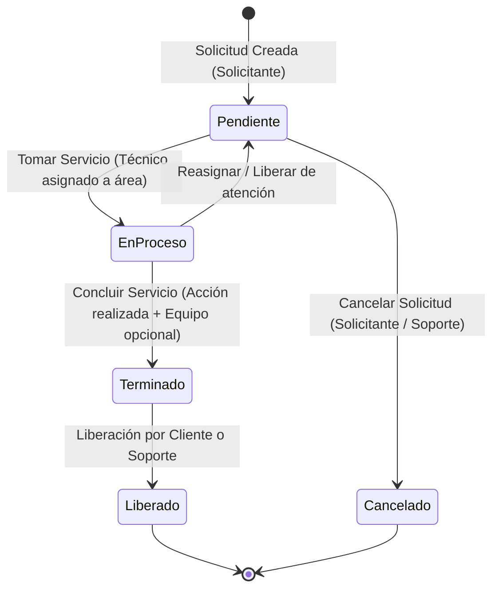

# Especificación de Diseño: Módulos de Soporte Técnico (Solicitar Servicio y Tomar Servicio)

**Fecha:** 2026-08-19  
**Estado:** Propuesta para Aprobación  
**Módulos Afectados:**
- `Solicitar Servicio` (`App\Http\Controllers\SoporteTecnico\SolicitarServicioController`)
- `Tomar Servicio` (`App\Http\Controllers\SoporteTecnico\TomarServicioController` - Migración completa desde `mTomarServicios`)

---

## 1. Resumen Ejecutivo
El sistema de Soporte Técnico permite gestionar el ciclo de vida completo de solicitudes de mantenimiento y soporte de equipo/software dentro de la institución. Este diseño perfecciona el módulo de **Solicitar Servicio** (lado del usuario/solicitante) y crea/migra el módulo de **Tomar Servicio** (lado del personal técnico) a la arquitectura estándar de Laravel, con validaciones estrictas, auditoría de cambios y generación de hojas de servicio imprimibles con firmas.

---

## 2. Flujo de Estados y Ciclo de Vida del Servicio

### Reglas de Negocio y Transiciones de Estado:
1. **Creación (Pendiente):**
   - Requiere que el usuario autenticado tenga registro en `trabajadores` con departamento y sede válidos.
   - `pendiente = 1`, `proceso = 0`, `terminado = 0`, `liberado = 0`, `estatus_final = NULL`.
2. **Cancelación:**
   - El solicitante puede cancelar su solicitud **únicamente si aún está en estado `Pendiente`** (`proceso = 0`).
3. **Toma de Servicio (En Proceso):**
   - El técnico debe estar asignado activamente al área del servicio en `soporte_area` (o rol administrador).
   - Se actualiza: `proceso = 1`, `id_personaServidor`, `nombre_servidor`, `sexo_servidor`, `fecha_tomado`, `hora_tomado`, `clasificacion_servicio` (Ordinario / Urgente / Preventivo / Correctivo), `id_uss`.
4. **Conclusión de Servicio (Terminado):**
   - El técnico captura: descripción de acciones realizadas (`accion_realizada`), tipo de servicio (`id_tipo_servicio`, `tipo_servicio`), y de forma opcional selecciona equipo del inventario (`id_mobiliario`, `inventario`, `descripcion_mobiliario`) del área o marca "Servicio general / Sin equipo".
   - Se actualiza: `terminado = 1`, `fecha_termino`, `hora_termino`.
5. **Liberación Final (Liberado):**
   - Puede ser liberado por el **Cliente** (desde `Solicitar Servicio`) o por el **Técnico** (desde `Tomar Servicio`).
   - Se actualiza: `liberado = 1`, `estatus_final = 'Liberado'`, `fecha_finaliza`, `hora_finaliza`, `liberadox = 'Cliente' | 'Soporte'`.
6. **Modificación de Fechas con Auditoría:**
   - Si se ajusta la fecha/hora de petición o tomado, se guarda: `modificado = 1`, `modificadox = [Nombre del usuario]`, `motivo_modificado`, `fecha_modificado`, `hora_modificado`.

---

## 3. Arquitectura de Módulos

### A. Módulo: Solicitar Servicio (`solicitar_servicio.*`)
Rutas: `/solicitar-servicio`
- **`index`:** Catálogo visual de áreas activas con indicador de servicios pendientes del usuario. Modal para registrar nueva solicitud con validación en tiempo real.
- **`store`:** Validación estricta (`id_area` existe y activa, `descripcion` min 10 caracteres, extracción segura de datos del trabajador).
- **`seguimiento`:** Lista paginada con buscador AJAX de servicios activos (Pendiente, En Proceso, Terminado). Acciones:
  * Ver detalles en modal con línea de tiempo visual.
  * Cancelar solicitud (si sigue en Pendiente).
  * Liberar servicio (si ya está Terminado).
- **`historial`:** Consulta de servicios finalizados (Liberados / Cancelados) con visualización de hoja de servicio.
- **`detalles`:** Endpoint JSON con información completa del servicio, técnico asignado, extensión y equipo involucrado.
- **`cancelar`:** Cancelación de solicitud pendiente con motivo.
- **`liberar`:** Liberación con confirmación.
- **`reportes` & `graficas`:** Reporte imprimible filtrable por rango de fechas y estado, y dashboard analítico de solicitudes del usuario.

### B. Módulo: Tomar Servicio (`tomar_servicios.*`)
Rutas: `/tomar-servicios` (Acceso controlado por middleware / permisos de `soporte_area`)
- **`index` (Bandeja de Pendientes):**
  * Filtra servicios en estado `pendiente = 1, proceso = 0, liberado = 0` pertenecientes a las áreas asignadas al técnico logueado.
  * Botón para **"Tomar Servicio"** con modal de clasificación/prioridad.
- **`mis_servicios` (En Proceso):**
  * Servicios tomados por el técnico logueado (`proceso = 1, terminado = 0, id_personaServidor = auth`).
  * Botón **"Concluir Servicio"** con modal que carga dinámicamente el catálogo de inventario/mobiliario del área y catálogo de `tipo_servicio`.
  * Botón **"Ajustar Fechas"** con modal de auditoría de motivos.
- **`por_liberar` (Terminados):**
  * Servicios completados en espera de liberación por el cliente o disponibles para liberación técnica.
  * Acción de **"Liberar por Soporte"** y visualización/descarga de **"Hoja de Servicio"**.
- **`historial`:**
  * Historial integral de servicios atendidos por el técnico o su área, con filtros por fecha, área, técnico y solicitante.
- **`hoja_servicio` (PDF / Vista Imprimible):**
  * Documento con diseño institucional limpio para impresión directa o guardado en PDF: folio, solicitante, departamento, extensión, fechas de atención, descripción del problema, diagnóstico, solución aplicada, datos del equipo y firmas de conformidad.
- **`reportes` & `graficas`:**
  * Analítica para el equipo de soporte (servicios por área, tiempos promedio de respuesta, tipos de falla más frecuentes).

---

## 4. Validaciones de Seguridad e Integridad de Datos

| Escenario | Validación / Manejo |
|---|---|
| Usuario sin registro de trabajador | Mensaje de error claro con instrucciones de vincular su perfil con Recursos Humanos. |
| Intento de tomar servicio de otra área | Verificación en backend de que `id_area` pertenezca a las áreas del técnico en `soporte_area` (a menos que sea SuperAdmin). |
| Intento de tomar un servicio ya tomado por otro | Bloqueo por concurrencia mediante verificación previa y transacción. |
| Cancelación de servicio en proceso | Impedir cancelación si `proceso = 1`. |
| Liberación de servicio no terminado | Impedir liberación si `terminado = 0`. |
| Ajuste de fecha sin motivo | Validación requerida de motivo de modificación (mínimo 5 caracteres). |

---

## 5. Plan de Verificación

1. **Pruebas de Flujo Completo:**
   - Crear solicitud desde un usuario solicitante.
   - Iniciar sesión como técnico de soporte y verificar que aparezca en la bandeja de pendientes de su área.
   - Tomar el servicio (verificar transición a `En Proceso` y datos del servidor registrados).
   - Concluir el servicio asociando equipo de inventario y acciones realizadas.
   - Verificar la actualización del estado a `Terminado` en el panel del solicitante.
   - Liberar el servicio como solicitante y verificar cierre con `liberadox = 'Cliente'`.
   - Generar y revisar la Hoja de Servicio imprimible.
2. **Pruebas de Casos Borde y Validaciones:**
   - Intentar cancelar una solicitud ya tomada.
   - Intentar tomar una solicitud con un usuario sin áreas asignadas.
   - Modificar fechas y verificar registro en campos de auditoría (`modificado`, `modificadox`, `motivo_modificado`).
